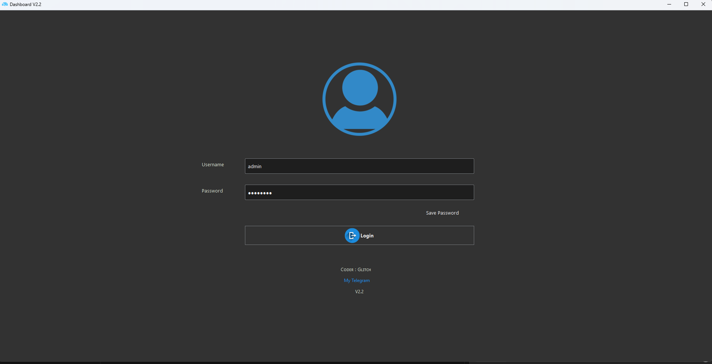
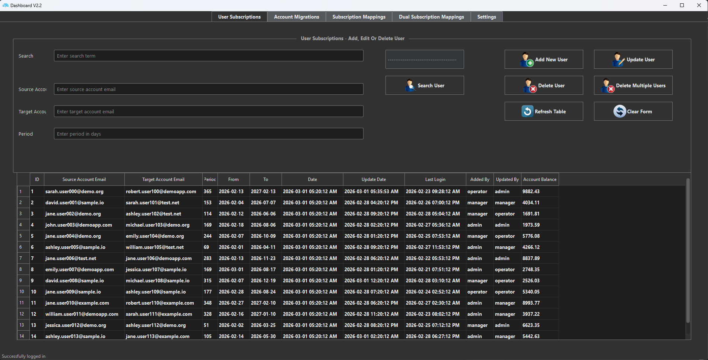
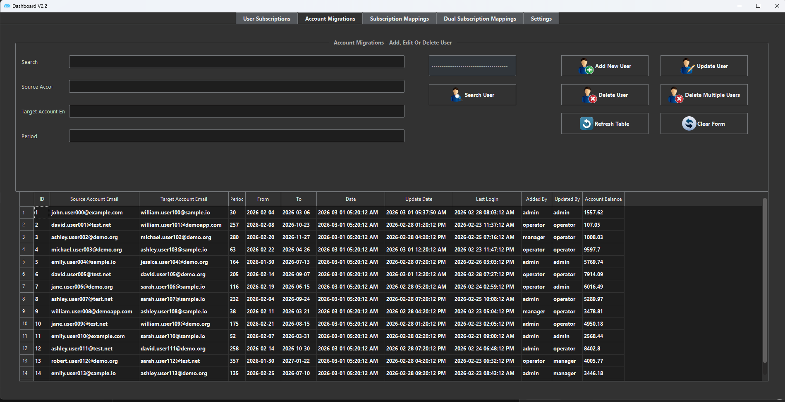
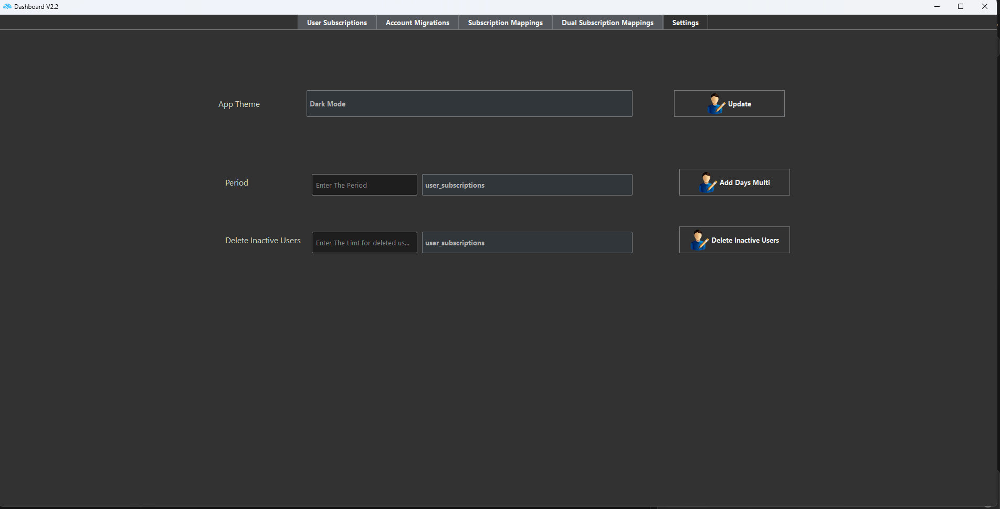

# Dashboard Application

A professional PyQt5-based backend management system for user accounts and subscriptions. This application provides a comprehensive interface for managing user data across multiple database tables with full CRUD operations.


## 📋 Table of Contents

- [Features](#features)
- [Screenshots](#screenshots)
- [Installation](#installation)
- [Usage](#usage)
- [Project Structure](#project-structure)
- [Database Schema](#database-schema)
- [Architecture](#architecture)
- [Contributing](#contributing)
- [License](#license)

## ✨ Features

- **User Authentication** - Secure login system with session management
- **Multi-Table Management** - Manage data across 4 different database tables
- **Full CRUD Operations** - Create, Read, Update, and Delete functionality
- **Advanced Search** - Search by ID, email, or multiple criteria
- **Bulk Operations** - Add extra days to multiple users, delete inactive users
- **Theme Support** - Light and dark mode themes
- **Threaded Operations** - Asynchronous data fetching for better performance
- **Data Validation** - Input validation and error handling
- **Auto-Resize Columns** - Dynamic table column sizing based on content

## 📸 Screenshots

> **Note:** Add your project screenshots to the `screenshots/` directory. Suggested screenshots:
> - `login.png` - Login screen (first image shown)
> - `dashboard.png` - User Subscriptions tab (main default view after login)
> - `user-management.png` - Account Migrations tab (shows another management interface)
> - `settings.png` - Settings panel

### Login Screen

*Secure login interface with user authentication*

### Main Dashboard

*Main dashboard showing User Subscriptions management interface*

### User Management

*Account Migrations management interface with full CRUD operations*

### Settings Panel

*Application settings including theme selection and bulk operations*

## 🚀 Installation

### Prerequisites

- Python 3.7 or higher
- PyQt5

### Setup

1. **Clone the repository**
   ```bash
   git clone https://github.com/yourusername/dashboard-application.git
   cd dashboard-application
   ```

2. **Install dependencies**
   ```bash
   pip install -r requirements.txt
   ```

3. **Create the demo database**
   ```bash
   python setup_demo_db.py
   ```

4. **Run the application**
   ```bash
   python main.py
   ```

### Default Login Credentials

- **Username:** `admin`
- **Password:** `admin123`

## 💻 Usage

### Basic Operations

1. **Login** - Enter your credentials to access the dashboard
2. **View Data** - Navigate through tabs to view different tables
3. **Search** - Use the search functionality to find specific records
4. **Add Users** - Fill in the form and click "Add New User"
5. **Update Users** - Search for a user, modify fields, and click "Update User"
6. **Delete Users** - Search for a user and click "Delete User", or use bulk delete with comma-separated IDs

### Advanced Features

- **Bulk Add Days** - Go to Settings tab, select a table, enter days, and click "Add Days Multi"
- **Delete Inactive Users** - In Settings tab, select a table, enter limit, and click "Delete Inactive Users"
- **Theme Switching** - Use the theme dropdown in Settings to switch between light and dark modes

## 📁 Project Structure

```
Dashboard/
├── main.py                  # Main application entry point
├── database.py              # Database connection utilities
├── table_operations.py      # Table CRUD operations
├── user_manager.py          # User management logic
├── config.py                # Configuration constants
├── ui_main.py               # UI definitions (auto-generated)
├── setup_demo_db.py         # Database setup script
├── demo_dashboard.db        # SQLite database (created by setup)
├── requirements.txt         # Python dependencies
├── README.md                # This file
├── LICENSE                  # MIT License
├── .gitignore              # Git ignore rules
├── .gitattributes          # Git attributes
├── blue_theme.css          # Light theme stylesheet
├── dark_theme.css          # Dark theme stylesheet
├── grey_theme.qss          # Grey theme stylesheet
├── resource.qrc             # Resource file
├── resource_rc.py          # Resource code
├── Dash.ui                  # UI file
├── ico/                     # Application icons
└── icons/                   # Additional icons
```

## 🗄️ Database Schema

The application uses SQLite with the following tables:

### manage_users
User authentication and session management.

### user_subscriptions
Basic user subscription management with source/target accounts.

### account_migrations
Account migration records between different systems.

### subscription_mappings
Subscription mappings with user ID tracking.

### dual_subscription_mappings
Dual subscription mappings with both source and target user IDs.

All data tables include common columns:
- `source_account` - Source account email
- `target_account` - Target account email
- `period` - Subscription period in days
- `from_date` - Start date
- `to_date` - End date
- `date` - Creation timestamp
- `update_date` - Last update timestamp
- `added_by` - User who created the record
- `updated_by` - User who last updated the record

## 🏗️ Architecture

### Design Patterns

- **MVC-like Pattern** - Separation of concerns between UI, business logic, and data access
- **Module-based Architecture** - Code organized into focused, reusable modules
- **Threading** - Background data fetching to prevent UI freezing

### Key Components

- **Main Window** (`main.py`) - Handles UI events and coordinates operations
- **Database Layer** (`database.py`) - Manages database connections
- **Operations Layer** (`table_operations.py`) - Handles table-specific operations
- **Business Logic** (`user_manager.py`) - User management and validation

### Database Migration

Originally designed for **remote MySQL**, the application has been refactored to use **SQLite** for easy setup and demonstration.

## 🔧 Development

### Running Tests

```bash
python -m pytest tests/
```

### Code Style

The project follows PEP 8 style guidelines. Use a linter to check code quality:

```bash
pylint main.py
```

## 📝 Notes

- This is a demo version originally designed for remote MySQL
- All sensitive information has been removed
- Table and column names have been generalized for portfolio presentation
- The database is local SQLite for easy setup and demonstration
- Demo data includes both expired and active subscriptions for realistic testing

## 🤝 Contributing

Contributions are welcome! Please feel free to submit a Pull Request.

1. Fork the project
2. Create your feature branch (`git checkout -b feature/AmazingFeature`)
3. Commit your changes (`git commit -m 'Add some AmazingFeature'`)
4. Push to the branch (`git push origin feature/AmazingFeature`)
5. Open a Pull Request

## 📄 License

This project is licensed under the MIT License - see the [LICENSE](LICENSE) file for details.

## 👤 Author

**Your Name**

- GitHub: [@yourusername](https://github.com/yourusername)
- Email: your.email@example.com

## 🙏 Acknowledgments

- PyQt5 community for excellent documentation
- SQLite for providing a lightweight database solution
- All contributors who helped improve this project

---

⭐ If you find this project useful, please consider giving it a star!
